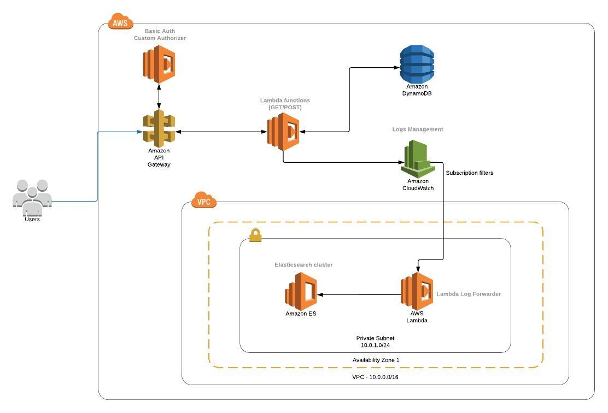

# go-todo-aws-lambda-es

## Architecture



Deploying this solution sets up:
* An API gateway to expose four Lambda functions
* Four Lambda functions which implement the following functionalities:
    * Retrieve a task by ID (GET /task/{id})
    * Retrieve all tasks (GET /task)
    * Save a new task (POST /task)
    * Basic authentication (/auth)
* A Lambda function to forward the logs to an AWS Elasticsearch domain
* AWS Elasticsearch domain (1 node)
* An Internet gateway
* A VPC, a subnet and a security group for the Elasticsearch instance and the log forwarder

## Under the hood 

Below there is a brief explanation of what you can find inside the project:

```
.
├── go                              <-- Go source files
│   ├── src
│       ├── go-todo-app             <-- A simple task management app in Go
│           ├── Makefile            <-- Make to automate build
│           ├── functions           <-- Source code for a lambda functions
│           │   ├── auth.go         <-- Basic authentication Lambda function code (API Gateway Custom Authorizer)
│           │   ├── get.go          <-- Get task by ID Lambda function code
│           │   ├── list.go         <-- List all tasks Lambda function code
│           │   └── post.go         <-- Create new task Lambda function code
│           ├── dao
│           │   ├── taskdao.go      <-- DynamoDb DAO (get, list, save operations)
│           └── serverless.yaml     <-- Serverless yaml file to deploy Lambda functions 
├── nodejs                          <-- NodeJS source files
│   ├── log-forwarder               <-- Function which forwards CloudWatch logs\' events to ES  
│       ├── aws-data-message.json   <-- An example of JSON event payload generated by CloudWatch 
│       ├── handler.js              <-- Lambda function to forward logs to ES 
│       ├── package.json            <-- NPM package file
│       ├── test-data.json          <-- An example of JSON log event
│       └── serverless.yaml         <-- Serverless yaml file to deploy Lambda functions 
├── terraform                       <-- Terraform source files
│   ├── elasticsearch               <-- Elasticsearch provisioning Terraform files 
|       ├── main.tf                 <-- Terraform main module
|       ├── outputs.tf              <-- Terraform output variables definition 
|       ├── variables.tf            <-- Terraform input variables definition
├── README.md                       <-- This instructions file
```

## Requirements

* AWS CLI already configured with at least PowerUser permission
* [Golang](https://golang.org)
* [Python 3](https://www.python.org/downloads/)
* [pip](https://pypi.org/project/pip/)
* [NodeJS](https://www.npmjs.com/get-npm)
* [Terraform](https://www.terraform.io/intro/getting-started/install.html)
* [Serveless framework](https://serverless.com/framework/docs/providers/aws/guide/quick-start/)

## Setup process

These instructions will get you a copy of the solution ready to be deployed. See deployment for notes on how to deploy the project on AWS.

### Installing dependencies

#### Todo Go app
First of all, you need to specify the location of your workspace. Run the following command to do it (from the project root): 

```shell
$ export GOPATH=$GOPATH:`pwd`/go
```

Then, run the commands below (from the project root) to install all the dependecies:

```shell
$ cd go/
$ go get ./...
```
#### Log forwarder

Run the following commands (from the project root) to install all the dependecies:

```shell
$ cd nodejs/log-forwarder
$ npm install
```

### Building

#### Go Lambda functions
In order to run and/or deploy the lambda functions, you have to build the executeable targets.
Preparing a binary to deploy to AWS Lambda requires that it is compiled for Linux.

Go in the *go/src/go-todo-app* directory

```shell
$ cd go/src/go-todo-app
```

and then issue the following command in a shell to build it:

```shell
$ make build
```
**NOTE**: The previous command builds the Lambda functions for a Linux environment (specifing `GOOS` and `GOARCH` environment variables). If you need to run it locally on macOS, you can use the following command:

```shell
$ make build-local
```

### Local development

```shell
$ virtualenv -p python3 .
$ source bin/activate
$ pip3 install -r requirements.txt
```

#### Invoking function locally through Serverless framework (go-todo-app)
```shell
$ serverless invoke -f list -l
```

## Deployment

### Elasticsearch cluster 

The *terraform/elasticsearch* directory contains a Terraform module to provision an AWS Elasticsearch domain. 
Using this module you can create an Elasticsearch domain and join it to a VPC with the access policy based on a security group applied to Elasticsearch domain.

To provision a new domain go to the *terraform/elasticsearch* directory and run the following commands (from the root of the project):

```shell
$ terraform apply
```

then enter the value for the logical enviroment where you want to deploy the domain (e.g. dev) and the AWS account ID where you want to deploy it. 

This command will also populate all the output values defined in the output.tf file. 

These values are needed in the next steps of the deployment process. For instance, you will need the security group ID and the subnet ID newly created to deploy the log forwarder lambda function. 

### Lambda function packaging and deployment

You can use Serverless framework to deploy all the Lambda functions.

Serveless use SSM parameters as the source for the parameters below:
* Basic authentication username (basicAuthUsername)
* Basic authentication password (basicAuthPassword)
* AWS account ID (accountId)

So, you need to create the parameter before running the deploy command. See [here](https://docs.aws.amazon.com/cli/latest/reference/ssm/put-parameter.html) for more information. 

#### Go Lambda functions

**Requirements:**
You need to compile the Lambda function, see [Building] section. 

To package the Lambda functions, run the following command from *go/src/go-todo-app* directory which upload the package to S3, deploy them and expose the endopints through an API Gateway:

```shell
$ serverless deploy
```

You can also specify the logical environment where you plan to deploy the functions by using the --stage parameter. If not specified, "dev" value is used as default. 

```shell
$ serverless deploy --stage dev
```

#### Log forwarder

**Requirements:**
This function needs valid subnet, security group and Elasticsearch endpoint as parameters. You have to use the same values that have been returned as output by Terraform, after the provisioning of the Elastisearch domain. See [Elasticsearch cluster].

Run the following command from *nodejs/log-forwarder* directory to package the Lambda function, upload it to S3 and deploy it. 

```shell
$ serverless deploy --endpoint `terraform output -state=./../../terraform/elasticsearch/terraform.tfstate es_endpoint` --securityGroup `terraform output -state=./../../terraform/elasticsearch/terraform.tfstate security_group` --subnet `terraform output -state=./../../terraform/elasticsearch/terraform.tfstate subnet_id` --stage dev
```

## License
[MIT](https://choosealicense.com/licenses/mit/)
